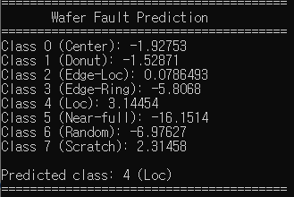

# Wafer Defect Classification C++ Inference Engine

A C++ inference pipeline for wafer defect classification using OpenCV and ONNX Runtime.

This project deploys a PyTorch-trained CNN model into a native C++ application.
The trained model is exported to ONNX format and executed using ONNX Runtime.

The project demonstrates an end-to-end machine learning deployment workflow:

```text
PyTorch Model Training
          |
          v
      ONNX Export
          |
          v
C++ Inference Deployment
```

---

# Overview

The CNN model was originally trained using PyTorch on the WM-811K wafer defect dataset.

After training, the model was exported into ONNX format and deployed with a C++ inference application.

The C++ pipeline reproduces the same preprocessing steps used during Python inference:

```text
Input Wafer Image
        |
        v
OpenCV Preprocessing
(grayscale → float32 → normalization → resize 24x24)
        |
        v
ONNX Runtime Inference
        |
        v
Wafer Defect Classification
```

---

# Architecture

The deployment pipeline consists of:

```text
PyTorch CNN Model

        |
        | ONNX Export

        v

wafer_fault_cnn.onnx

        |
        v

C++ Inference Application

        |
        +----------------+
        |                |
        v                v

    OpenCV          ONNX Runtime
 Preprocessing       Inference

        |
        v

Wafer Defect Prediction
```

---

# Features

- C++17 inference application
- OpenCV-based image preprocessing
- ONNX Runtime model inference
- CMake build system
- Native deployment of PyTorch-trained CNN model
- Python and C++ numerical consistency validation
- Inference latency benchmarking

---

# Inference Pipeline

## Input

```text
Wafer image (.png)
```

## Preprocessing

The C++ preprocessing pipeline:

```text
Grayscale conversion
        |
        v
Convert to float32
        |
        v
Normalize values to 0-1
        |
        v
Resize image to 24 x 24
```

## Model Input

```text
Tensor shape:

[1, 1, 24, 24]
```

## Output

The model predicts one of 8 wafer defect classes.

```text
8-class wafer defect classification
```

---

# Project Structure

```text
wafer-cpp-inference/

├── src/
│   └── main.cpp
│
├── models/
│   └── wafer_fault_cnn.onnx
│
├── results/
│   └── test_wafer.png
│
├── images/
│   └── inference_result.png
│
├── CMakeLists.txt
└── README.md
```

---

# Environment

- C++17
- OpenCV 4.14
- ONNX Runtime 1.28.1
- CMake 3.20+
- Visual Studio 2022

---

# Build

Create build directory:

```bash
mkdir build
cd build
```

Configure:

```bash
cmake ..
```

Build:

```bash
cmake --build .
```

---

# Run

Execute the inference application:

```bash
.\Debug\wafer_inference.exe
```

Example output:

```text
[SUCCESS] Image loaded: ../results/test_wafer.png

[SUCCESS] ONNX model loaded!

========================================
       Wafer Fault Prediction
========================================

Class 0 (Center): -6.43398
Class 1 (Donut): -4.77504
Class 2 (Edge-Loc): -1.29985
Class 3 (Edge-Ring): -8.76927
Class 4 (Loc): 3.15065
Class 5 (Near-full): -20.402
Class 6 (Random): -9.00057
Class 7 (Scratch): 1.96966

Predicted class: 4 (Loc)

========================================
```



---

# Performance Benchmark

Inference performance was measured using two different approaches.

## Benchmark Configuration

- Runtime: ONNX Runtime C++
- Input shape: 1 × 1 × 24 × 24
- Warm-up runs: 10
- Benchmark runs: 100

## Results

| Metric | Result |
|---|---:|
| ONNX Runtime latency | 0.0317 ms |
| ONNX Runtime FPS | 31,506 |
| End-to-End latency | 0.3735 ms |
| End-to-End FPS | 2,677 |

## Measurement Scope

### ONNX Runtime Benchmark

Measures only neural network execution:

```text
Tensor Input
      |
      v
ONNX Runtime Inference
      |
      v
Output
```

### End-to-End Pipeline Benchmark

Measures the complete inference pipeline:

```text
Image Loading
      |
      v
OpenCV Preprocessing
      |
      v
Tensor Creation
      |
      v
ONNX Runtime Inference
      |
      v
Prediction
```

---

# Numerical Consistency Validation

The same ONNX model was tested using:

| Runtime | Prediction |
|---|---|
| Python ONNX Runtime | Class 4 |
| C++ ONNX Runtime | Class 4 |

Result:

```text
Prediction Match: True

Maximum absolute difference:
2.1457672e-06
```

The preprocessing pipeline was also verified between Python and C++.

Python:

```text
0: 0.0
1: 0.0
2: 0.0
3: 0.0
4: 0.0
5: 0.0
6: 0.0
7: 0.0
8: 0.328125
9: 0.21875
```

C++:

```text
0: 0
1: 0
2: 0
3: 0
4: 0
5: 0
6: 0
7: 0
8: 0.328125
9: 0.21875
```

The ONNX inference results between Python and C++ were numerically consistent.

---

# Related Project

## Model Training Repository

PyTorch training and evaluation pipeline:

https://github.com/lucy980509/wafer-defect-classification
